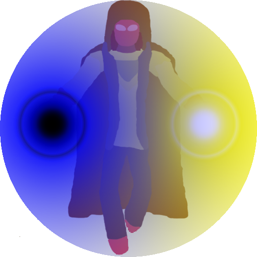

<link rel="apple-touch-icon" sizes="180x180" href="/apple-touch-icon.png">
<link rel="icon" type="image/png" sizes="32x32" href="/favicon-32x32.png">
<link rel="icon" type="image/png" sizes="16x16" href="/favicon-16x16.png">
<link rel="manifest" href="/site.webmanifest">
<link rel="mask-icon" href="/safari-pinned-tab.svg" color="#5bbad5">
<meta name="msapplication-TileColor" content="#2d89ef">
<meta name="theme-color" content="#ffffff">

# Hello, wanderer!

[Download game (at least what's done at the moment) (currently nothing)](
        https://github.com/Mirage-A/SW-Client/raw/master/SW%20-%20Game.jar
      )

### Wtf is this?
Shattered World is an isometric action-RPG with next-gen level graphics!

### Why don't you use game engines to create your useless game in a reasonable time?
Because only noobs use game engines, cool guys write their own wheels all their life!

### Use Photoshop at least, why Paint, oh, my eyes!
No.

### So, when will it be ready?
Soon (c) ~~(probably never)~~

### Some useless links
[My Github profile](https://github.com/Mirage-A)

[Shattered World client repository](https://github.com/Mirage-A/SW-Client)

[My animation editor repository](https://github.com/Mirage-A/SW-Animation)

[My VK page](https://vk.com/ardenit1)
